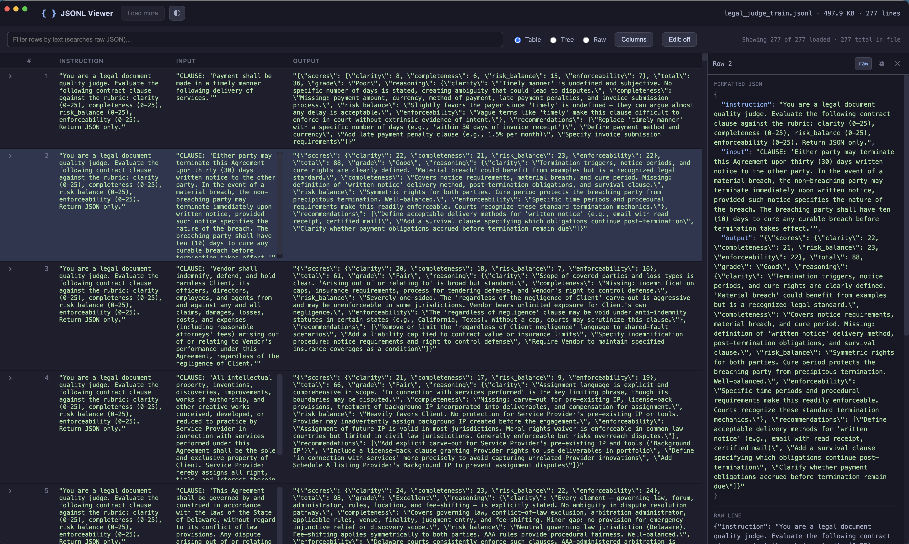

# JSONL Viewer

A small desktop Electron app for viewing and inspecting `.jsonl` / `.ndjson` (JSON Lines) files.



## Features

- **Open via dialog or drag-and-drop** a file onto the window.
- **Streamed parsing** — large files are read line-by-line; the first 5,000 lines parse for instant viewing, with a *Load more* button to fetch the next batches.
- **Table view** — automatically collects object keys across rows and renders a column per key, with syntax highlighting per cell.
- **Tree view** — each line is a collapsible node; expand it to browse nested objects/arrays as an interactive tree, with every container node independently collapsible and a count summary.
- **Raw view** — toggle to see each line's verbatim text with line numbers.
- **Row expand** — click `+` on any row to expand the full pretty-printed JSON with syntax highlighting.
- **Live filter** — search box filters rows by raw text (case-insensitive).
- **Row preview sidebar** — click any row to show its full pretty-printed JSON and raw line in a right sidebar, with copy-to-clipboard and close controls.
- **Resizable columns** — drag the right edge of any table header to resize; widths persist across sessions via `localStorage`.
- **Column visibility** — a *Columns* button (Table view) opens a dropdown of checkboxes to show/hide individual columns; preference persists via `localStorage`.
- **Edit mode** — toggle the *Edit* button to make Table cells, Raw lines, and the sidebar's formatted JSON editable; changes re-parse and update the line in place. **Save** silently overwrites the current file (also `Cmd/Ctrl+S`); **Save as…** (File menu / `Cmd/Ctrl+Shift+S`) opens a dialog to write a new file.
- **Native menus** — File menu (Open File, Open Recent submenu with Clear History, Save, Save As), Edit menu (Copy / Copy JSON / Copy raw of the selected row), View menu (switch views, theme submenu, cycle theme, dev tools).
- **Open recent** — the File → Open Recent submenu lists recently opened files (persisted via `localStorage`); click one to reopen, or **Clear Recent History** to wipe the list.
- **Themes** — a theme picker in the toolbar (and a View → Theme submenu / `Cmd/Ctrl+Shift+T` cycle shortcut) let you choose between Mocha, Tokyo Night, Dracula, Gruvbox Dark, Solarized Dark, GitHub Dark, One Dark, Latte, Solarized Light, and GitHub Light. Each theme recolors both the app chrome and the JSON syntax highlighting; the preference is remembered via `localStorage`.
- **Parse-error tolerance** — invalid lines are flagged inline with the error message rather than breaking the whole view.
- macOS-style hidden inset title bar with a draggable toolbar.

## Run

```bash
npm install
npm start
```

For development with detached DevTools:

```bash
npm run dev
```

Then click **Open File** (or drag a file in) and pick `sample.jsonl` from this repo, or any of your own `.jsonl` / `.ndjson` / `.json` / `.log` / `.txt` files.

## Project layout

```
jsonl-viewer/
├─ package.json
├─ src/
│  ├─ main.js        # Electron main process: window, dialog, streamed file reading
│  └─ preload.js     # contextBridge API exposed to the renderer
└─ renderer/
   ├─ index.html
   ├─ themes.css     # theme palettes (CSS variables per data-theme)
   ├─ styles.css     # layout / components, consumes theme variables
   └─ renderer.js    # UI logic: table/raw views, filter, expand, drag-drop, themes
```
