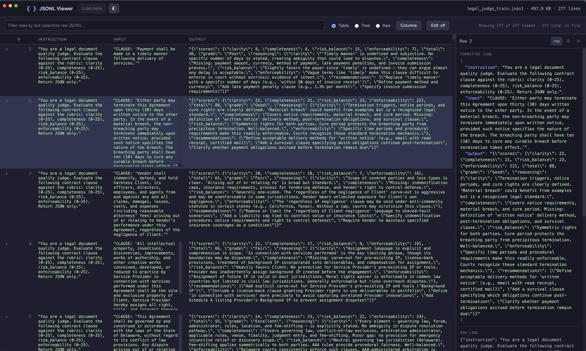

# JSONL Viewer

[](https://github.com/donvito/jsonl-viewer/releases/latest)
[](https://github.com/donvito/jsonl-viewer/releases)

[](./LICENSE)

A small desktop Electron app for viewing and inspecting `.jsonl` / `.ndjson` (JSON Lines) files.



## Download

Installers for macOS, Windows and Linux are on the
[latest release](https://github.com/donvito/jsonl-viewer/releases/latest).

The builds are unsigned, so macOS shows an unidentified-developer prompt on
first open — right-click the app and choose *Open* — and Windows SmartScreen
shows an unknown-publisher prompt.

## Run from source

```bash
npm install
npm start
```

For development with detached DevTools:

```bash
npm run dev
```

Then click **Open File** (or drag a file in) and pick `test/sample.jsonl` from this repo, or any of your own `.jsonl` / `.ndjson` / `.json` / `.log` / `.txt` files. Hugging Face session traces from STS, Pi, Codex, Claude Code, and Hermes are detected automatically and open in the Traces view. The toolbar's **Traces** menu also finds recent sessions in the standard Codex, Claude Code, Pi, and Hermes locations.

## More

- [Features](./FEATURES.md)
- [Building installers](./BUILDING.md)
